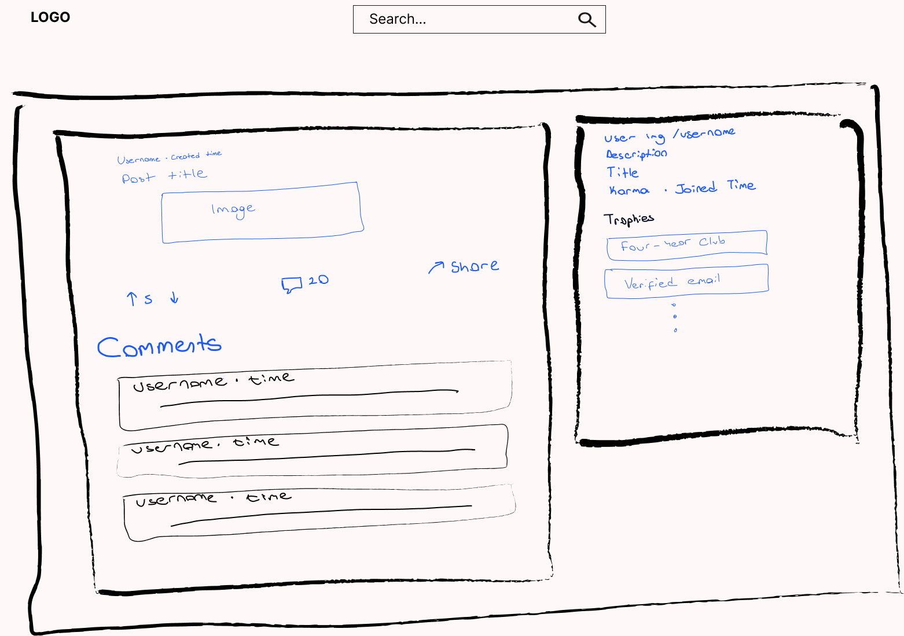

# 📘 Reddit Client App

A modern Reddit client built with **React**, using **Redux Toolkit**, **Tailwind CSS**, and the **Reddit JSON API**. Features include post browsing, subreddit filtering, comments view, and voting simulation.

---

## 🚀 Live Demo

🔗 [Reddit Minimal](https://clientreddit.netlify.app/)

---

## 🖼️ Wireframes

| Home Page                                            | Post Detail                                          |
| ---------------------------------------------------- | ---------------------------------------------------- |
|  |  |

## 🛠️ Tech Stack

- **React** – component-based UI
- **Redux Toolkit** – efficient global state & async API calls
- **React Router** – client-side routing
- **Tailwind CSS** – utility-first CSS for styling
- **Axios** – for HTTP requests
- **Framer Motion** – for UI animations
- **Jest + React Testing Library** – for unit testing
- **Cypress** – for E2E testing
- **Reddit JSON API** – for fetching subreddit data

---

## 🧱 Project Structure

```plaintext
src/
├── components/
│   ├── CategoriesFilter.jsx      # Subreddit filter buttons
│   ├── LoadingSpinner.jsx        # Global loading spinner
│   ├── PostItem.jsx              # Single post display (vote, info, link)
│   ├── Header.jsx                # List of posts
│   ├── PostsDetail.jsx           # Post details with comments
│   ├── AuthorInfo.jsx
│   ├── PostButtons.jsx
│   └── SearchBar.jsx             # Subreddit search
├── features/
│   └── posts/
│   │   ├── PostsList.jsx
│       └── postsSlice.js         # Redux slice for posts
│   └── comments/
│       └── commentsSlice.js
├── utils/
│   ├── useWindowWidth.js
│   └── timeAgo.js                # Utility to format post times
├── pages/
│    └── store.js                 # Redux store configuration
├── App.jsx
```

---

## ✨ Features

- ✅ **Browse popular Reddit posts**
- ✅ **Filter posts by subreddit**
- ✅ **View post details with full comments**
- ✅ **Vote simulation with up/down arrows (local state)**
- ✅ **Friendly "time ago" formatting**
- ✅ **Responsive layout** (mobile, tablet, desktop)
- ✅ **Loading spinner & error handling**
- ✅ **Smooth transitions with Framer Motion**
- ✅ **Clean, reusable component structure**

---

## 🔌 Reddit JSON API Usage

**Base URL:**  
`https://www.reddit.com`

### 📥 Fetch posts:

```http
GET /r/{subreddit}.json
```

### 💬 Fetch Post Comments

```http
GET /r/{subreddit}/comments/{postId}.json
```

## 🔮 Planned Features

- 🌙 **Dark Mode**
- 🔁 **Infinite scroll**
- 🔐 **OAuth login & session management**
- 🔼 **Real voting via Reddit's authenticated API**
- 🔧 **Settings panel for UX preferences**

---

## ⚙️ Setup & Development

# Clone the repo

git clone https://github.com/selenkarakaya/reddit-client.git
cd reddit-client-app

# Install dependencies

npm install

# Start the development server

npm run dev

## 📦 Deployment

**Platforms:**  
Netlify

## 📊 Lighthouse Score

| Category       | Score |
| -------------- | ----- |
| Performance    | 93    |
| Accessibility  | 95    |
| Best Practices | 100   |
| SEO            | 83    |

---

## Test Coverage Summary

| File/Folder            | % Statements | % Branches | % Functions | % Lines | Uncovered Lines |
| ---------------------- | ------------ | ---------- | ----------- | ------- | --------------- |
| **All files**          | 94.25%       | 93.04%     | 93.15%      | 95.58%  |                 |
| **components**         | 95.41%       | 94.04%     | 93.75%      | 96.42%  |                 |
| - AuthorInfo.jsx       | 91.17%       | 95.83%     | 83.33%      | 92.3%   | 41, 56          |
| - CategoriesFilter.jsx | 94.73%       | 83.33%     | 100%        | 100%    | 40-41           |
| - LoadingSpinner.jsx   | 100%         | 100%       | 100%        | 100%    |                 |
| - PostButtons.jsx      | 95.23%       | 93.1%      | 93.33%      | 94.73%  | 48, 59          |
| - PostComments.jsx     | 100%         | 100%       | 100%        | 100%    |                 |
| - PostDetail.jsx       | 100%         | 100%       | 100%        | 100%    |                 |
| - PostItem.jsx         | 100%         | 100%       | 100%        | 100%    |                 |
| - SearchBar.jsx        | 100%         | 100%       | 100%        | 100%    |                 |
| **features/posts**     | 90.19%       | 82.35%     | 95%         | 90.9%   |                 |
| - PostsList.jsx        | 100%         | 100%       | 100%        | 100%    |                 |
| - postsSlice.js        | 83.33%       | 40%        | 91.66%      | 85.18%  | 11-13, 45       |
| **utils**              | 96.29%       | 100%       | 80%         | 100%    |                 |
| - timeAgo.js           | 100%         | 100%       | 100%        | 100%    |                 |
| - useWindowWidth.js    | 87.5%        | 100%       | 75%         | 100%    |                 |

## 📌 Notes

- `timeAgo.js` is a shared utility used in both `PostItem` and `PostDetail` components to format post timestamps.
- Voting is **simulated client-side only** — no interaction with Reddit's API.
- Comments and posts are fetched via **two-step Reddit API calls**.
- **Error boundaries** and fallback UIs are in place to handle crashes and failed data fetches gracefully.

### 👤 Author

Built as part of **Codecademy’s Reddit Client Project** with additional custom features.

🛠 Maintained by **Selen Karakaya**  
📫 [selennurkarakayaa@gmail.com](mailto:selennurkarakayaa@gmail.com)  
🐙 [github.com/selenkarakaya](https://github.com/selenkarakaya)  
📌 [LinkedIn](https://www.linkedin.com/in/selenkarakaya/)  
🌍 [Portfolio Website](https://selenkarakaya.netlify.app/)
